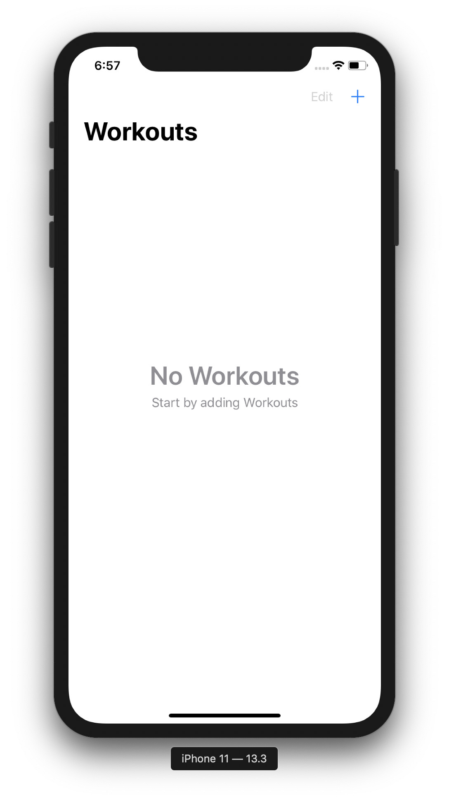
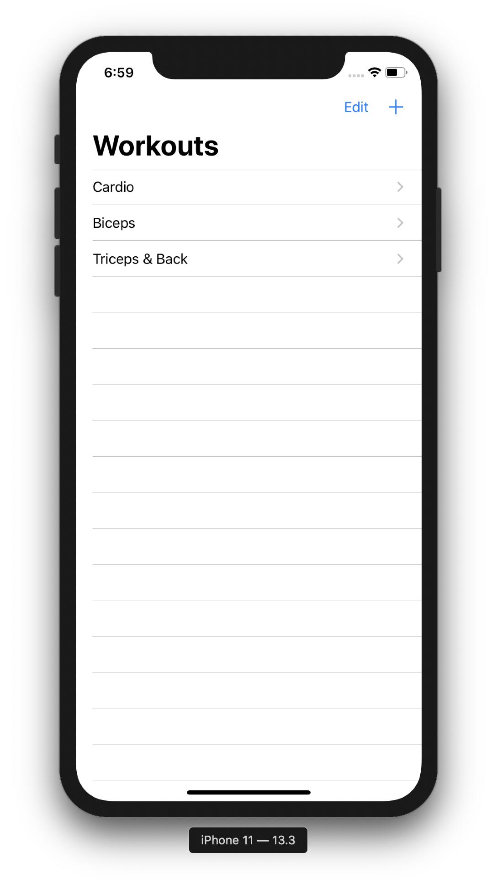
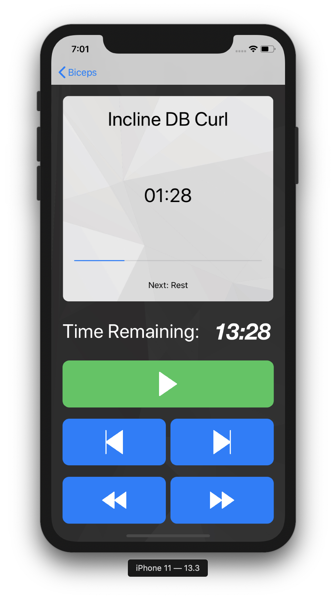
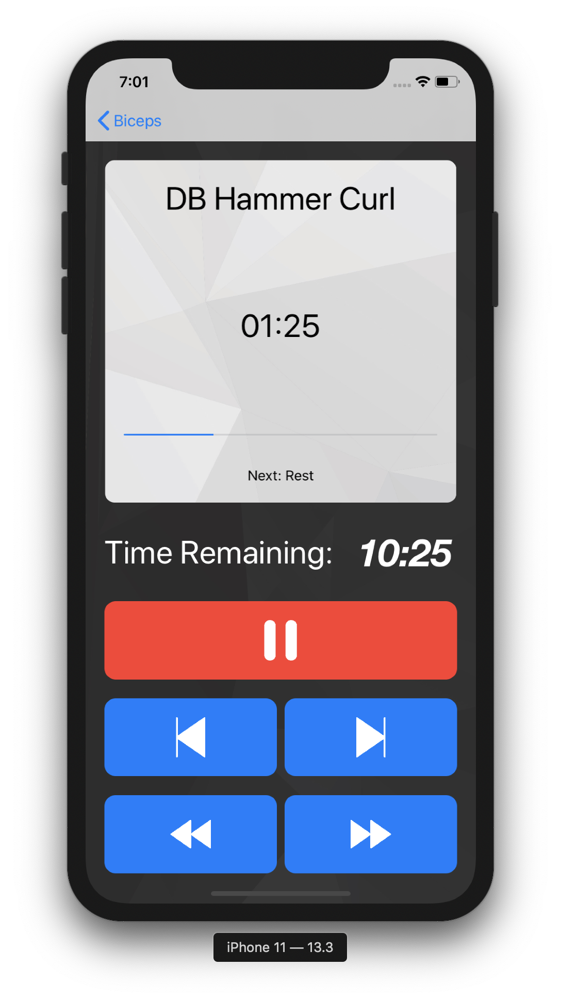

#  WorkoutGo
WorkoutGo is a exercise timer app for iOS. With this you can create highly customized workout routines with timed exercises.

## Screenshots
Workouts (Empty table view)|Workouts table view|Adding Exercise
---|---|---
||

Exercise table view|Exercise (Paused)|Exercise (Playing)
---|---|---
||

#### GIFs
###### NOTE: GIFs are large in size, so it may take a little while for them to load
Workouts & Exercise|Exercise Operations|View Controller Transition (Slow Motion)
---|---|---
||

## General Info
The goal of this project was to do a hands-on of some of the features that are *above absolute basics*.

Here is the list of some of the features I have used
* Core Data - To store the workouts and exercises. And running queries to fetch the data.
* View Controller transition animation - Shown in show motion in one of the screenshots above.
* Reusable views using xib.
* Custom ```UIButton``` - Highlights itself when tapped. Initially made to look in 3D, but then dropped the idea as I found that use of *flat style* is the norm. The code to making it look 3D is present as commented code.
* Play sounds using ```AVAudioPlayer```. Sounds are played at:
    * Play/Pause of exercise.
    * Ticking sound to indicate last 5 seconds of each exercise.
    * Jump to next/previous.
* Extensive use of ```Timer```.
* Creating shadows on views and more.

## Project Status
The project is still work in progress and might have some minor issues as well.
Next enhancment would be to provide pre-configured popular workout routines. Also add mechanism to push new routines using public iCloud etc.
